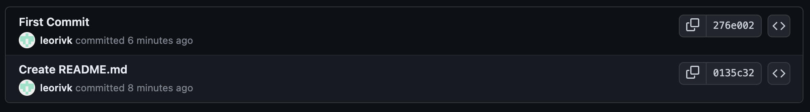

# CLI

### Working Directory → Staging Area

<pre>git add file name</pre>

- 해당 파일 add
<pre>git add .</pre>
- 모든 파일 add

 

### Staging Area → Local Repository

<pre>git commit</pre>

- `i` 입력하면 INSERT 모드로 전환
- Commit Message 입력 후 ESC키 누르면 INSERT 모드 종료
- `:wq` 입력하면 Commit 완료

<pre>git commit -m commit message</pre>

- Commit Message 입력까지 동시에 수행

 

### Local Repository → Remote(Github) Repository

<pre>git push origin main</pre>

 

## Commit Log

<pre>git log</pre>

 
: Local Repository의 최신 커밋

 
: Github Repository의 최신 커밋, 아직 Local Repository의 최신 커밋이 반영되지 않은 상태

 
: Local Repository의 최신 커밋이 Github Repository에도 커밋된 상태

 

## Reset

### Hard Reset

: HEAD 포인터를 지정된 커밋으로 이동, 지정된 커밋 이후의 모든 커밋 삭제

- **_Hard Reset 이전_**

    

    

   

- **_Hard Reset_**

    <pre>git reset --hard HEAD~1</pre>

  > `HEAD~n` 대신에 지정할 커밋의 해쉬를 입력해도 됨

 

- **_Hard Reset 이후_**

    

  - Working Direcotry, Staging Area 어디에도 지정된 커밋 이후의 변경 사항 존재하지 않음

 

- **_Hard Reset한 내용 Github Repository에 강제로 Push_**
    <pre>git push origin main --force</pre>

    

 

### Soft Reset

: HEAD 포인터를 지정한 커밋으로 이동, 지정된 커밋 이후의 변경 사항 Working Direcory와 Staging Area에 유지

<pre>git reset --soft HEAD~1</pre>

 

`git status`를 통해 상태 확인

 

- Staging Area에 변경 사항 존재

- Working Directory에도 변경 사항 유지

 

→ 이후 커밋만 해주게 되면 reset 이전의 모든 변경 내용 복구

 

### Mixed Reset

: HEAD 포인터를 지정한 커밋으로 이동, 지정된 커밋 이후의 변경 사항을 Untracked 상태로 유지

<pre>git reset HEAD~1</pre>

`git status`를 통해 상태 확인

 

- Untracked 상태의 파일에 변경 사항 존재

→ add 이후 커밋 해주어야 reset 이전의 변경 내용 복구

 

## Checkout

: 작업 디렉토리를 변경하거나 브랜치를 전환하는 데 사용

### ✓ 브랜치 전환

<pre>git checkout branch-name</pre>
 

### ✓ 새 브랜치 생성 + 전환

<pre>git checkout -b branch-name</pre>
 

### ✓ 특정 커밋으로 전환

<pre>git checkout commit-hash</pre>
 

### ✓ 파일 복구

<pre>git checkout -- file-name</pre>

→ 변경된 파일을 최신 커밋 상태로 되돌림

 

## Amending Commit

: 커밋한 이후 수정할 사항이 있을 때 사용

<pre>git commit --amend</pre>

- 가장 최근 커밋을 수정
- 편집기로 커밋 메시지도 수정 가능

 

<pre>git commit --amend-m commit-message</pre>

- 커밋 메시지 수정까지 한 번에 수행

 

<pre>git commit --amend --no-edit</pre>

- 커밋 메시지는 수정하지 않음

 

## Ignoring Files

`.gitignore` 파일에 명시된 파일 또는 패턴은 Git이 변경 사항을 추적하지 않음

 

### 파일 및 디렉토리

만약 `logs/` 디렉토리를 무시하고 싶다면 `.gitignore` 파일에 다음과 같이 명시

<pre>logs/</pre>

 

### 패턴

- `*.log` : 확장자가 .log인 모든 파일
- `*.txt` : 확장자가 .txt인 모든 파일
- `temp*.txt` : temp로 시작하는 모든 .txt 파일

 

### 주의 사항

이미 추적 중인 파일은 `.gitignore`에 추가해도 적용되지 않음 
→ 이미 커밋된 파일은 Git에서 추적되기 때문

이 경우 다음과 같은 명령어를 사용하여 추적 중지 가능

<pre>git rm --cached file-name</pre>

 

## 원격 저장소 명령어

✓ 원격 저장소 연결

<pre>git remote add [원격 저장소 이름] [원격 저장소 URL]</pre>

 

✓ 연결된 모든 원격 저장소 확인

<pre>git remote -v</pre>

 

✓ 원격 저장소의 최신 상태 확인

<pre>git fetch [원격 저장소 이름]</pre>

- 원격 저장소 이름은 생략 가능

 

✓ 원격 저장소의 변경 사항을 로컬로 가져오기

<pre>git pull [원격 저장소 이름]</pre>

- fetch를 수행한 이후 원격 저장소에 가져온 변경 사항을 로컬 브랜치에 병합

- 이 역시 원격 저장소 이름은 생략 가능

 

✓ 원격 저장소의 특정 브랜치를 로컬 브랜치로 병합

<pre>git merge [원격 저장소 이름/브랜치 이름]</pre>

 

✓ 로컬 커밋을 원격 저장소로 푸시

<pre>git push [원격 저장소 이름] [로컬 브랜치 이름]</pre>

 

✓ 원격 저장소에 대한 자세한 정보 확인

<pre>git remote show [원격 저장소 이름]</pre>

 

✓ 연결된 원격 저장소 제거

<pre>git remote rm [원격 저장소 이름]</pre>

 

✓ 원격 저장소 URL 변경

<pre>git remote set-url [원격 저장소 이름] [새로운 URL]</pre>

 

## Clone

: `git clone` 명령어는 원격 저장소의 내용을 복제하여 로컬에 새로운 Git 저장소를 만드는 데 사용 
→ 프로젝트, 협업을 위한 원격 저장소의 사본 생성 가능

<pre>git clone [원격 저장소 URL]</pre>

✓ 특정 폴더명으로 복제

<pre> git clone [원격 저장소 URL] [폴더명]</pre>

 

- 원격 저장소의 모든 내용(커밋 기록, 브랜치, 파일 등)이 로컬로 복제

- 복제된 저장소는 자동으로 origin이라는 이름의 기본 원격 저장소가 설정
