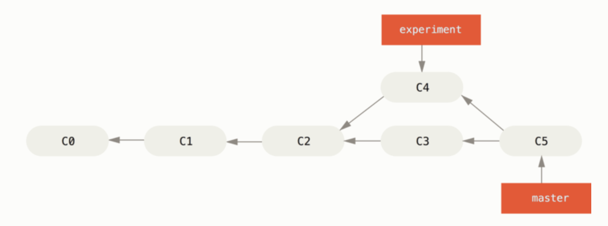
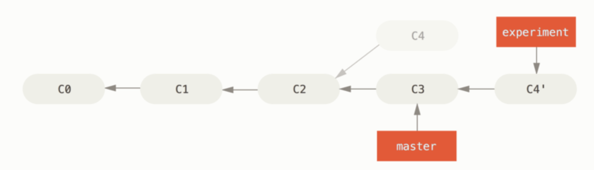
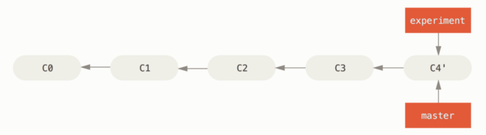

# Rebase

: 브랜치의 커밋 히스토리를 재조정

## Merge와의 차이점

### Merge

<pre>$ git checkout master
$ git merge experiment</pre>

→ Merge의 결과를 별도의 커밋으로 만들고 해당 브랜치가 그 커밋을 가리키도록 이동

 

### Rebase

<pre>$ git checkout experiment
$ git rebase master</pre>

1. 두 브랜치가 나뉘기 전인 공통 커밋(C2)으로 이동

2. 공통 커밋으로부터 checkout한 브랜치가 가리키는 커밋(C4)까지 임시로 어딘가에 저장

3. Rebase할 브랜치(experiment)가 합칠 브랜치(master)가 가리키는 커밋을 가리키게 한 후 임시로 저장해놓은 변경사항을 차례로 적용

 

이후 Fast-forward merge를 통해 C3에도 C4의 변경사항 적용

<pre>$ git checkout master
$ git merge experiment</pre>

C4'커밋에서의 내용은 Merge 예시에서의 C5와 같다. 
Merge와 달리 선형의 히스토리를 가지므로 보기에 더 깔끔하다는 장점이 있다.

 

### Rebase 주의점
