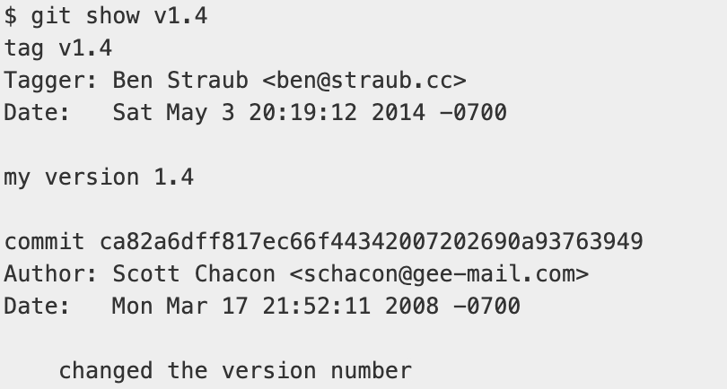

# Tag

: 커밋에 대해 의미있는 이름을 붙여주는 것, 주로 버전 관리, 중요한 이벤트 표시

### 태그 조회

`git tag` 명령으로 이미 만들어진 태그들 확인 가능

<pre>$ git tag</pre>

`-l` 옵션을 사용하여 태그 검색 가능

- 패턴 검색

    <pre>$ git tag -l "v1.*"</pre>

  "v1."로 시작하는 모든 태그를 출력

 

### Annotated 태그

: 태그를 만든 사람의 메타데이터, GPG 서명 포함 가능

tag 명령 실행 시 `-a` 옵션을 추가하여 생성

<pre>$ git tag -a v1.4 -m "my version 1.4"</pre>

`-m` 옵션으로 태그 저장 시 메시지 함께 저장

저장한 태그 정보와 커밋 정보는 `git show` 명령으로 확인

일반적으로 Annotated 태그를 통해 모든 정보를 함께 표시하는 것을 권장

 

### Lightweight 태그

: 커밋에 단순히 이름을 붙이는 것, 다른 정보는 저장 X

옵션 사용 X, 이름만 달아줄 뿐

<pre>$ git tag v1.4-lw</pre>

 

### 특정 커밋에 대해 태그

커밋 히스토리가 다음과 같다고 가정

밑줄 친 커밋을 태그하고 싶다면 명령의 끝에 커밋 체크섬 명시 (전부 명시할 필요 X)

<pre>$ git tag -a v1.2 9fceb02</pre>

 

### 원격 저장소에 태그 푸시

`git push` 명령은 원격 저장소에 자동으로 태그를 전송하지 않으므로 별도로 Push 필요

<pre>$ git push origin tag-name</pre>

원격 저장소에 없는 태그를 모두 Push하려면 `--tags` 옵션 추가

<pre>$ git push origin --tags</pre>

 

### 태그 Checkout
