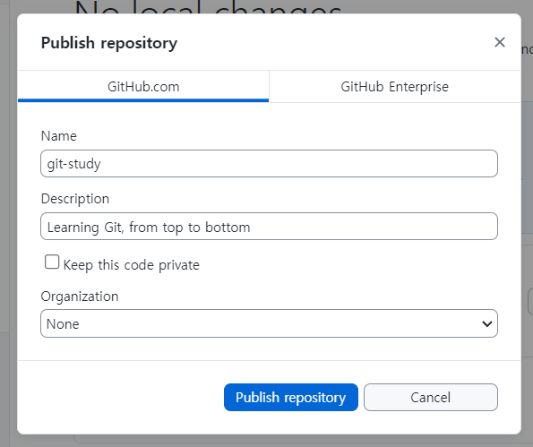

# Chapter02. Github

<br/>
<br/>

## 01. Trying out GitHub

현재 우리 코드는 local에만 존재하는 상태이다. github desktop에서  publish  눌러서 repository 연결해보자.

- github desktop에서 Publish repository를 선택한다.

    

- github에 접속해보면 repository가 업로드 된 것을 알 수 있다.

    

<br/>

### ✅ 이 작업으로 알 수 있는 점?

1. github은 git history를 올리는 곳이다.
    - 무슨일이 벌어졌는지 다 알 수 있음 ⇒ 우리의 수정 사항을 기록으로 남겨준다.
2. 단순히 git에 commit한다고 해서 github에 바로 반영되는 것은 아님 ⇒ **git push**를 해야 한다!
3. 명령어

```bash
git push -u origin main
```

<br/>
<br/>

## 2. ****Forking and Cloning****

### 1. Fork

- git이 아닌 github의 기능
- 전체 repository를 복사한다. (full version 복사본을 갖게 됨)
- fork된 repository는 **기존의 base ropository와 완전히 다른 프로젝트**가 된다.

- 실습해보기
    - fork 기능을 사용해서 내 github으로 repo를 복사해온다.
    
    
    

    

    - 복사완료

    

- 내 repository에 복사 된 것을 볼 수 있다. 그러면 **이 프로젝트를 어떻게 우리 컴퓨터로 가져올 수 있을까?** ⇒ **이때 git clone을 사용한다.**

<br/>

### 2. Clone

- github에 있는 repository를 나의 desktop에 복사해서 가져오는 것
- 명령어

```bash
git clone 복사하려는 주소
```

- 실습

    

### ➕ Fork vs branch

- 질문 참고
    
    
    
- 비교

| Fork  | Branch  |
| --- | --- |
| Cloning repository | 같은 repository지만, 다른 평행 세계 버전. 
ex. (지난 번 소설 속 다른 결말 버전) |

<br/>
<br/>

## 3. Pull Requests

- Clone해서 작업한 내용을 Base Repository에 반영하기 위해서 보내는 요청 사항이다.

- 실습
    - Clone해온 repository에 내가 작성한 내용을 commit 후 push 해본다.
    
    
    
    - 나의 repository에는 반영되었지만 원래의 base repository에는 반영되지 않은 것을 볼 수 있다.
    
    
    
    - **왜 그럴까?**
        - 만약 삼성 같은 큰 회사와 일하게 되었다고 생각해보자
            - 작업은 할 수 있지만 저장소에 접근할 권한이나 삭제, 비밀번호 변경 등의 권한은 가지고 있지 않을 것이다.
            - **“저장소를 fork한 후 그 저장소에서 작업을 하고 우리에게 알려줘”**라고 할 것이다.
            - 즉 변경된 내용을 반영해달라고 하는 요청 ⇒ **Pull Request**이다.
    - 해당 Base repo에 들어가서 New pull request 버튼을 누르면 된다.
    
    
    
    
    
    
    
    - 그 이후 base repo의 관리자가 merge pull request를 눌러준다면 **base repo에 개인적으로 작업한 내용들이 업데이트 된다.**
    
    
    
- 코드 병합이 완료되고 나면 **PR**을 보낸 사람에게 “Pull request colsed”라는 메시지가 보이게 된다.
- R**epo를 fork해서 작업한 후 코드 merge까지 성공했다면 fork했던 repo를 지워도 상관없다.**

즉 이러한 방식이 회사에서 협업 하는 방식이다. 
⇒ 중심에 큰 코드 저장소를 두고 PR로 코드를 반영한다.

<br/>
<br/>

## ****4 Origin and Upstream****

- 코드 변경 사항을 동기화 한다.
- 만약 fork한 후 베이스 코드 저장소에 코드 변경이 생긴다면?
    - 내가 fork해서 기능을 개발하는 동안 다른 누군가도 기능을 개발해서 마스터 저장소에 반영하는 상황
    - 내 코드가 최신상황 위에서 작업한 것이 아니게 되는 상황이 발생한다.
- 이럴 때 upstream 기능을 사용한다.
    - fork하면 항상 upstream branch가 만들어지는데 이것은 바로 base 저장소를 말한다.
    - base 저장소의 최신코드를 사용할 수 있다. (fetch origin)
    - 그 다음 upstream 코드를 현재 fork해온 branch에 merge 하면 된다.
- 이런 방식으로 협업에서의 변경사항이 반영되는 것이다.
    - 내가 작업한 사항을 base branch에 반영하고 싶다면? Pull Request를 사용하면 된다.
    

<br/>
<br/>

## 5. ****Issues****

- git의 기능이 아닌 github, gitlab, bitbucket 같은 저장소가 제공하는 기능
- 프로젝트가 해야 하는데 아직 하지 않은 일이나, 사람들이 발견한 문제나 버그 같은 것을 기록하는 것
- 오픈 소스에서 작업할 때나 Tester들이 문제를 찾아서 이슈를 적을 때 볼 수 있음
- 코드 저장소 소유자, 이슈 작성자 모두 이슈를 닫을 수 있다.

- 회사에서 일할 때 혹은 혼자 일할 때 사용 가능
    - ex.이 PR은 ###이슈를 해결하는 용이야! ⇒ 해결 후에는 issue를 닫으면 된다.
    - label을 붙일 수 도 있음
    
    
    

    

- Milestone
    - 버전을 올릴 때 필요한 것들을 모아두는 곳

    

- 마일스톤 예시

    

- 여기에 여러 issue들을 모아두고 issue가 모두 해결되면 마일스톤이 달성된다.

    