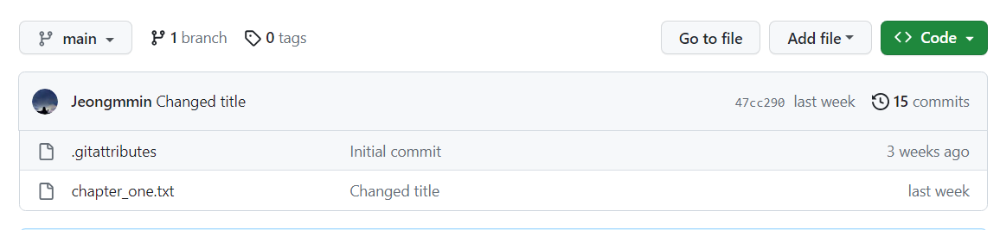

# Chapter 03. CLI - 2

상태: Not started

# 05. Amending Commits and Ignoring Files

- 브랜치 삭제 방법, 명령어

```bash
git branch -d 브랜치명
```

- 만약 파일을 commit하던 중에 실수로 아직 커밋할 상황이 아닌데 잘못 커밋을 했다면 어떻게 해야할까?
    - ex) chapter1 + chapter2를 한 번에 커밋하려고 했는데 chapter1만 커밋해버린 상황이다.
    - 방법1 : chapter2만 다시 추가로 커밋한다.
    - 방법2 : Amend를 사용한다. ✅

### Amend?

가장 마지막 커밋을 수정하는 것을 말한다.

- 명령어
    - 이때 메시지는 선택적으로 입력 가능 함

```bash
git commit --amend -m "메시지"
```

- 커밋 메시지는 수정하지 않고 커밋할 때 사용하는 명령어

```bash

git commit --amend --no-edit
```

- 이때 추가로 커밋할 파일들을 git add .으로 unstage → stage 상태로 변경시켜 준 후  amend를 진행해야 마지막 커밋에 추가 파일이 추가된다.

그 후 git push를 해주면 아래처럼 chapter1, 2가 한번에 커밋 → push된 것을 확인할 수 있다.



↓


- 커밋할 때 파일들의 상태보는 방법?
    - 

```bash
git status
```

- 빨간색 : stage 영역에 있지 않은 파일
- 초록색stage 영역에 있는 파일


위의 버튼을 눌러보지 않고도 현재 파일이 stage상태인지 unstage상태인지 알 수 있다.

✅ git에 추가하고 싶지 않은 파일이나 폴더가 있다면?

- .gitignore파일을 만들고 git에 추가하고 싶지 않은 파일을 입력한다.
    - 아래처럼 gitignore에 추가된 파일을 색이 연하게 바뀌고 숨김처리 된다.
     git add .을 해도 git에 업로드 되지 않는다.


- git에 staged된 파일, 폴더를 제거하려면?
    - git에 올리지 말아야 할 파일을 올렸을 때 사용, 원격 저장소에서도 삭제 됨

```bash
git rm 파일이름
git rm -r 폴더이름/ --chached
git rm -r 폴더이름/ --chached  이미 캐시되어서 없어지지 않을때 사용
```

# 0****6. Origins****

GitHub, BigBucket에서 만든 저장소를 내 컴퓨터로 불러오려면?

⇒ Remote를 사용하면 된다.

### **Remote?**

: 컴퓨터와 깃헙 사이의 커뮤니케이션을 말함, 컴퓨터의 깃 저장소가 원격(remote) 저장소에 연결되어 있다는 의미이다.

remore에는 orgin이 있다.

- origin 확인방법

```bash
git remote -v
```

- fetch : 데이터 가져오기
- push : 데이터 올리기


- remote 추가방법

```bash
git remote add 이름 url
```


- remote 삭제 방법

```bash
git remote remove 이름
```

- 실습


- Bigbucket의 장점?
    - board에서 trello를 연동해서 사용할 수 있음
    
    
    
- 예전에는 github이 private저장소를 제공하지 않았다. 그래서 많은 사람들이 gitlab, bigbucket을 썼지만 현재는 github도 private을 제공하기 때문에 github을 가장 많이 사용한다.

- gitlab의 장점?
    - CI가 잘 되어있다.
    - gitlab에 코드를 푸시할 때마다 테스트가 실행되고, 파이프라인을 설계하고, 무언가를 압축할 수 있다. but 깃헙에도 존재하는 기능이라서 선택해서 사용하면 된다.
    

# 0****7. Clone****

예전에 github desktop으로 해봤던 기능, 이제 cli를 이용해서 진행해보려고 함

1. github에서 fork를 진행한다.


1. desktop에 clone을 진행한다.

```bash
git clone 저장소주소
git clone 저장소주소 바꿀폴더이름  -> 선택적으로 가능함
```


1. 만들어진 폴더에서 vscode열기

```bash
code 폴더이름
```


1. 그대로 commit, push 진행
    - 이때 push된 파일을 fork된 나의 repo에만 등록된다.
    - 원래의 repo에 등록하려면 pullRequest를 사용하면 된다.
    

## 📌 Rebase

Git에서 브랜치를 사용할 때 한 브랜치에서 다른 브랜치로 합칠 때 사용하는 방법은 두 가지가 있다.

바로 Merge, Rebase이다. 둘을 사용할 때 최종 결과물은 같지만 커밋 히스토리가 달라진다는 사실이 중요하다.

| Merge | Rebase |
| --- | --- |
| 브랜치를 합칠 때 가장 많이 사용하는 방법 | 보통 리모트 브랜치에 커밋을 깔끔하게 적용하고 싶을 때 사용하는 방법 |
| 두 브랜치의 최종 결과만을 가지고 합친다. | 브랜치의 변경사항을 순서대로 다른 브랜치에 적용하면서 합친다. |
| 커밋과정을 그대로 볼 수 있다. but 복잡할 수 있음 | 조금 더 깨끗한 히스토리를 만들 수 있다. |

- 일단 아래와 같이 브랜치를 합치는 방법을 Merge라고 하며, 그 중 아래의 방법을 3-way Merge라고 한다.
    - 두 브랜치의 마지막 커밋 2개 + 공통조상인 (C2)를 사용하여 커밋


- 그리고 아래와 같이 커밋하는 방식을 Rebase라고 하는데, C3에서 변경된 사항을 Patch로 만든 후 이를 다시 C4에 적용시키는 방법이다.


- 명령어
    
    ```bash
    git checkout experiment
    git rebase master
    ```
    

- 이 과정에서 실제로 일어나는 일은 다음과 같다.
    1. 두 브랜치가 나뉘기 전인 공통커밋(C2)로 이동
    2. 그 커밋부터 지금 Checkout한 브랜치(experiment)가 가리키는 커밋까지 diff를 차례로 만들어 어딘가에 임시로 저장해둠
    3. Rebase할 브랜치(experiment)가 합칠 브랜치(master)가 가리키는 커밋을 가리키게 하고 아까 저장해 놓았던 변경사항(C4’)를 차례대로 적용한다.
    4. 그 후 master 브랜치를 **Fast-forward** 시킨다.
        1. **Fast-forward**  방식?
            - 빨리감기, 앞으로 이동
            - A브랜치가 다른 B 브랜치를 Merge할 때 B 브랜치가 A브랜치 이후의 커밋을 가리키고 있으면 그저 A브랜치가 B브랜치와 동일한 커밋을 가리키도록 이동시키는 것을 말한다.
            - C4’ 커밋이 C3 커밋에 기반한 브랜치이기 때문에 브랜치 포인터는 Merge과정 없이 그저 최신 커밋으로 이동한다. 이런 Merge방식을 Fast forward라고 부른다.

```bash
git checkout master
git merge experiment
```

- Rebase의 결과는 다음과 같다.


결과적으로는 3-way merge의  C5와 Rebase의 C4’의 결과는 같다.

Merge, Rebase 둘 중 어느것을 사용할지는 각자의 상황과 판단에 달려있지만 Rebase를 사용할 때는 주의해야한다. 보통은 로컬 브랜치에서 작업할 때는 히스토리 정리를 위해 Rebase를 사용해도 상관없지만, 리모트 등 어딘가에 push로 내보낸 커밋에 대해서는 절대 Rebase 하지 말아야 한다.

## 💡 CerryPick

히스토리를 한 줄로 관리하기 위해 Merge보다 Rebase나 Cherry-Pick을 선호하는 개발자들이 많이 있다.

여기서 Cherry-Pick이란 커밋하나만 Rebase하는 것을 의미한다. 커밋하나로 Patch 내용을 만들어 현재 브랜치에 적용하는 것이다.

토픽 브랜치에 있는 커밋 중에서 하나만 고르거나 토픽 브랜치에 커밋이 하나 밖에 없을 때 Rebase보다 유용하다.

- 아래의 그림에서 **e43a6** 커밋 하나만 master branch에 적용하고 싶다면?


- 명령어

```bash
git cherry-pick e43a6(커밋 아이디)
```

위와 같이 명령을 적용하면 e43a6커밋이 현재 브랜치에 똑같이 적용된다. 하지만 변경을 적용한 시점이 다르므로 새 커밋의 SHA-1 해시 값(commit id)은 달라진다.

e43a6 → a0a41

