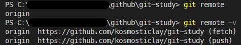

# Git Study Week 2

## 📌 2강 : GITHUB

### ✔️ 기본 개념

- Fork : 하나의 저장소에 대한 하나의 복사본
- Pull Request : 원격 저장소의 특정 브랜치에 push한 후, 병합 전에 검토를 요청할 때 사용
- Upstream Branch : 특정 로컬 브랜치와 연결된 원격 저장소의 브랜치
  > origin = upstream, local = downstream<br/>push와 pull을 기준으로 생각했을 때 origin으로부터 local로 흐르는 관계가 형성되기 때문<br/>\* push : local -> origin<br/>\* pull : origin -> local
- Issue : 미해결된 부분이나 발견된 문제, 버그등에 관한 것들을 이슈로 생성해 기록
- MileStone : 버전을 올릴 때 필요한 것들을 따로 리스트로 모아두는 것 (목표 작업들)
  <br/><br/>

### ✔️ Organization에 합류 및 branch 생성

0. 새로운 git repository 생성
   ```
   git init
   ```
     <br/>
1. 주어진 URL에서 Git 저장소를 복제하고, 로컬에 새로운 디렉토리를 생성하여 그 안에 저장소의 모든 파일과 Git 기록을 복사

   ```
   git clone [URL]
   ```

   - `git clone [URL]`은 아래 명령어를 포함한 작업

     | 명령어                        | 설명                                                                                                                                                                                                                      |
     | ----------------------------- | ------------------------------------------------------------------------------------------------------------------------------------------------------------------------------------------------------------------------- |
     | `git init`                    | 새로운 Git 저장소를 초기화;<br/>현재 디렉토리에 .git 폴더를 생성(Git 버전관리 시작)                                                                                                                                       |
     | `git remote add origin [URL]` | 원격 저장소를 현재의 로컬 저장소에 연결; <br/>\* origin : 원격 저장소의 단축명 <br/>\* URL : 원격 저장소 URL 주소                                                                                                         |
     | `git fetch origin main`       | 원격저장소에서 특정 브랜치의 데이터를 가져와 로컬에 저장;<br/>(여기서는 origin 원격 저장소의 main 브랜치)<br/>\* 원격 저장소의 데이터를 로컬로 가져오지만, 현재 작업 중인 로컬 브랜치의 변경사항과 자동으로 병합하지 않음 |

<br/>

2. 현재 로컬 저장소의 모든 브랜치 목록을 조회

   ```
   git branch
   ```

   

    <details>
    <summary>
    git branch 옵션 리스트
    </summary>

   | 옵션                  | 설명                                                                                           |
   | --------------------- | ---------------------------------------------------------------------------------------------- |
   | `-a` , `--all`        | 로컬 및 원격 저장소에 존재하는 브랜치 목록 조회                                                |
   | `-d`, `--delete`      | 병합된 브랜치만 삭제<br/>(병합되지 않은 브랜치는 안전장치로 삭제 불가)                         |
   | `-D`                  | 병합 여부와 상관없이 브랜치 강제 삭제                                                          |
   | `-m`, `--move`        | 브랜치의 이름 변경                                                                             |
   | `-M`                  | 브랜치 이름 강제 변경<br/>(이미 존재하는 브랜치 이름으로 변경할 때 사용)                       |
   | `-c`, `--copy`        | 현재 브랜치를 기반으로 새 브랜치를 생성                                                        |
   | `-C`                  | 현재 브랜치를 기반으로 새 브랜치를 강제 생성<br/>(기존에 동일한 이름의 브랜치가 있어도 덮어씀) |
   | `-l`, `--list`        | 현재 로컬 브랜치 목록 조회                                                                     |
   | `--merged`            | 지정된 커밋에 병합된 브랜치만 조회                                                             |
   | `--no-merged`         | 지정된 커밋과 병합되지 않은 브랜치만 조회                                                      |
   | `--contains [commit]` | 지정된 커밋을 포함하는 브랜치 목록 조회                                                        |
   | `--sort=<key>`        | 특정 키를 기준으로 브랜치 목록 조회                                                            |
   | `-i`, `--ignore-case` | 브랜치 검색시 대소문자 구분X                                                                   |
   | `-v`, `--verbose`     | 각 브랜치의 마지막 커밋을 포함한 상세 정보를 출력                                              |
   | `--abbrev=<length>`   | 커밋 해시의 길이를 지정                                                                        |

    </details>
   <br/>

3. 새로운 브랜치를 생성하고 그 브랜치로 전환(checkout)

   ```
   git checkout -b [branch]
   ```

   

   - `git checkout -b [브랜치명]`은 아래 명령어를 포함한 작업
     |명령어|설명|
     |--|--|
     |`git branch [branch]`|새 브랜치 생성|
     |`git checkout [branch]`|브랜치 생성 후, Git을 새로운 브랜치로 ‘checkout’<br/>(작업트리와 인덱스가 새 브랜치의 최신 커밋을 반영하도록 업데이트 되며, ‘HEAD’가 새 브랜치를 가리키게 된다.)|

       <details>
       <summary>
       git checkout 옵션 리스트
       </summary>

     | 옵션            | 설명                                                                                                                                       |
     | --------------- | ------------------------------------------------------------------------------------------------------------------------------------------ |
     | `-b`            | 새 브랜치 생성 후, 해당 브랜치로 전환                                                                                                      |
     | `-B`            | 새로운 브랜치 강제 생성                                                                                                                    |
     | `-l`            | 새로운 브랜치를 생성하고, 현재의 HEAD를 추적하도록 설정                                                                                    |
     | `-f`, `--force` | 작업 트리의 변경사항이나 커밋되지 않은 변경사항은 무시하고 브랜치 전환                                                                     |
     | `-m`, `--merge` | 변경 사항이 있는 경우, 브랜치를 전환하기 전에 변경 사항 병합                                                                               |
     | `-p`, `--patch` | 변경 사항을 부분적으로 전환(체리픽)                                                                                                        |
     | `--detach`      | 브랜치를 분리한 HEAD 상태로 전환<br/>\(즉, 특정 커밋을 가리키지만 브랜치로 참조되지는 않은 상태<br/>예: git checkout --detach [커밋 해시]) |

   </details>
   <br/>

4. 현재 디렉토리의 모든 변경 사항을 스테이징 영역에 추가

   ```
   git add .
   ```

   - 일반적으로 커밋 전에 git add [파일명] 명령어를 통해 수동으로 스테이징
   - `.` 은 모든 변경사항을 의미
     <br/>

5. 현재 인덱스(스테이징 영역)에 추가된 변경사항들을 새로운 커밋으로 "message"와 함께 저장

   ```
   git commit -m “message"
   ```

   - `-a` 옵션을 이용하여 해당 과정을 건너뛰고 모든 변경사항을 자동으로 스테이징
     (예: `git commit -a -m “kosmosticlay’s week1 summary”`)
     <br/>

6. 로컬 저장소의 브랜치를 원격 저장소에 업로드

   ```
   git push origin [branch]
   ```

   - 즉, pull request를 위해 원격 저장소에 브랜치를 push
     <br/><br/>

### ✔️ Upstream Branch

- 다른 사람들과 협업하거나 오픈 소스 프로젝트에 기여할 때, 항상 로컬 및 포크한 저장소를 최신 상태로 유지해야 한다.<br/>

  - 새로운 작업을 하기 전 (로컬에 클론을 만든 직후(예: 위의 1번 과정 후))
  - 변경 사항을 원격 저장소에 푸시하기 전 (예: 위의 5번 과정 전)
  - 원본 저장소에 변경사항이 존재할 때
    <br/>

#### 원본 저장소를 fork 하지 않고 직접적으로 클론을 한 경우<br/>

- origin은 클론한 원본 저장소를 의미
- 원본 저장소에 변경사항이 발생할 경우, 커밋 전에 해당 변경사항을 로컬 저장소에 업데이트 필요<br/>

1. 원본 저장소의 모든 브랜치의 변경사항 가져오기 (병합은 안된 상태)
   ```
   git fetch origin
   ```
2. 로컬 저장소의 브랜치와 병합하기 위해 작업 중인 브랜치로 checkout
   ```
   git checkout [branch]
   ```
3. 원본 저장소의 main 브랜치에서 변경사항을 병합<br/>
   ```
   git merge origin/main
   ```
4. 로컬 저장소의 변경사항을 원본 저장소로 푸시
   ```
   git push origin [branch]
   ```
   <br/>

#### 원본 저장소를 fork한 후, 자신의 원격 저장소에서 클론을 한 경우<br/>

- origin은 fork한 자신의 원격 저장소를 의미
- 따라서, 원본 저장소를 upstream이라는 별도의 원격으로 추가하여 관리 필요

1. fork를 로컬 저장소에 클론하여 origin 설정
   ```
   git clone [fork한 원격 저장소]
   ```
2. 로컬 저장소의 위치(디렉토리)로 이동 \* [저장소이름]은 클론한 저장소의 URL에서 .git을 제외한 마지막 부분의 이름을 의미

   ```
   cd [저장소이름]
   ```

   - : 원본저장소가 https://github.com/organisation/myrepo.git 일 경우, 기본적으로 `myrepo`라는 이름의 폴더가 로컬에 생성
     (예: `cd myrepo`)
     <br/>

   - ⚠️ 로컬 저장소(디렉토리)로 이동한 후 upstream을 설정하는 이유
     > Git 명령은 현재 위치한 디렉토리의 컨텍스트에서 실행된다. 즉, Git 명령을 실행하면 Git은 현재 디렉토리에서 '.git'이라는 하위 디렉토리를 찾으려고 시도한다. 이 '.git' 디렉토리는 Git이 해당 디렉토리를 Git 저장소로 인식하게 하는 데 필요한 모든 메타데이터와 정보를 포함하고 있다. <br/>
     > 따라서 해당 디렉토리로 이동함으로써 git remote add upstream과 같은 Git 명령어들이 올바른 컨텍스트, 즉 올바른 저장소 내에서 실행된다. 만약 이 디렉토리 외부에서 이 명령을 실행하면 Git은 현재 위치가 Git 저장소가 아니라고 판단하여 오류를 발생시킨다.

3. 원본 저장소를 upstream으로 추가 -> 원본 저장소의 변경사항을 추적 가능<br/>
   ```
   git remote add upstream [원본저장소]
   ```
4. 작업할 새 브랜치를 생성 및 체크아웃<br/>
   ```
   git checkout -b [new-branch]
   ```
5. 코드 변경 후 커밋
   ```
   git add .
   git commit -m "message"
   ```
6. 변경사항을 fork한 원격 저장소로 푸시
   ```
   git push origin [new-branch]
   ```
7. 원본 저장소에 변경사항이 존재할 수 있으므로 이를 로컬 저장소로 져오기 (병합은 안된 상태)
   ```
   git fetch upstream
   ```
8. main 브랜치를 최신 상태로 유지하기 위해 upstream 변경사항을 병합
   ```
   git checkout main
   git merge upstream/main
   ```
9. 최신 변경사항을 작업 브랜치(new-branch)에 병합

   ```
   git checkout [new-branch]
   git merge main
   ```

   > ⚠️ 로컬 main 브랜치와 작업 브랜치(new-branch) 비교
   >
   > - 로컬 main 브랜치 : 로컬 저장소에 있는 'main' 브랜치를 의미하며, 원본 저장소의 최신 상태를 반영하기 위해 사용하는 곳
   > - 작업 브랜치(new-branch) : 새로운 기능 개발, 버그 수정등 개별 작업을 위해 생성한 작업 브랜치로 실제 코드 변경 작업을 수행하는 곳

10. fork한 저장소(원격 저장소)에서 PR(Pull Requests)을 생성하여 원본 저장소에 요청

<br/><br/>

### ✔️ 그외 명령어 목록

| 명령어          | 설명                                                                        |
| --------------- | --------------------------------------------------------------------------- |
| `git remote`    | 현재 연결된 원격 저장소의 별칭 목록을 조회<br/> (예: `origin` , `upstream`) |
| `git remote -v` | 연결된 원격 저장소의 URL 확인<br/>     |

<br/>

### ✔️ git fetch / git pull 비교

| 명령어      | 설명                                                                                                       |
| ----------- | ---------------------------------------------------------------------------------------------------------- |
| `git fetch` | 원격 변경 사항을 로컬에 가져오되, 병합하지 않는다.                                                         |
| `git pull`  | 원격 변경 사항을 로컬에 가져오고, 현재 브랜치에 병합한다. <br/> \* `git fetch`와 `git merge`를 합친 명령어 |

---

## ✏️추가 스터디

- Pull Request 과정 중 에러 발생 여부 확인 하기
- Issue 작성
- Milestone 활용
- 연습용 organisation 저장소 생성(쓰기권한 포함)하여 각자 터미널에서 브랜치 생성하기

## 😵 에러

- 원본 저장소에서 직접 브랜치 생성 불가

  - 에러 메시지

    ```
    remote: Permission to 2023-Git-Github-Study/git-study.git denied to kosmosticlay.
    fatal: unable to access 'https://github.com/2023-Git-Github-Study/git-study/': The requested URL returned error: 403
    ```

  - 에러 원인

    - 403 오류는 권한이 없을 때 발생하는 HTTP 오류 코드
    - 원본 저장소에 대한 쓰기 권한이 없음을 의미

  - 해결 방법

    - 원본 저장소의 관리자에게 쓰기 권한 요청
    - 권한을 얻지 못할 경우, fork한 후 원본 저장소에 PR 생성하여 변경사항 제안 요청

---

## 📖 References

- ['모두를 위 깃&깃허브', 노마드코더](https://nomadcoders.co/git-for-beginners/lobby)
- ['GitHub에서 협업을 위한 remote repository와 upstream 이해하기', Hack IT](https://pers0n4.io/github-remote-repository-and-upstream/)
