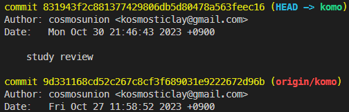

# Git Study Week 3

## 📌 3강 : CLI I

### ✔️ 명령어 추가 학습

- 콘솔창에서 git 명령어 실행 전에 작업 디렉토리인지 확인해야 한다.

| 명령어                         | 설명                                                                                                                                                                                                                                                                                                                                                                                                                                                                                                                                                                                                                                                                                                                                                                                                                                                                                        |
| ------------------------------ | ------------------------------------------------------------------------------------------------------------------------------------------------------------------------------------------------------------------------------------------------------------------------------------------------------------------------------------------------------------------------------------------------------------------------------------------------------------------------------------------------------------------------------------------------------------------------------------------------------------------------------------------------------------------------------------------------------------------------------------------------------------------------------------------------------------------------------------------------------------------------------------------- |
| `git log`                      | 커밋 히스토리 조회<br/> \* HEAD -> master : 로컬 컴퓨터로 커밋<br/> \* origin/master : github 원격 저장소에 올라간 커밋<br/>                                                                                                                                                                                                                                                                                                                                                                                                                                                                                                                                                                                                                                                                                                           |
| `git add`                      | working directory에서 변경된 파일들을 staging area에 추가<br/>(다음커밋에 추가할 준비)<br/> \* `git add [파일명]` : 특정 파일만 스테이징<br/> \* `git add .` : 모든 변경사항 스테이징                                                                                                                                                                                                                                                                                                                                                                                                                                                                                                                                                                                                                                                                                                       |
| `git checkout`                 | 1. `git checkout [브랜치명]` : 해당 브랜치로 전환<br/> 2. `git checkout [커밋 해시값]` : 해당 커밋으로 HEAD 이동<br/> 3. `git checkout -- [파일명]` : 해당 파일의 변경사항을 모두 버리고 이전 커밋 상태로 변경(띄어쓰기 주의)                                                                                                                                                                                                                                                                                                                                                                                                                                                                                                                                                                                                                                                               |
| `git revert`                   | 버전을 되돌리되 되돌아간 상태에 대한 새로운 버전(커밋)을 생성                                                                                                                                                                                                                                                                                                                                                                                                                                                                                                                                                                                                                                                                                                                                                                                                                               |
| `git reset`                    | 커밋을 되돌리거나 스테이징 영역의 변경사항을 제거<br/>                                                                                                                                                                                                                                                                                                                                                                                                                                                                                                                                                                                                                                                                                                                       |
| `git reset --soft`             | 작업 디렉토리 내 변경사항과 스테이지에 추가된 변경사항은 유지하되, 커밋했다는 사실만 되돌리는 reset (즉, 되돌릴 커밋의 변경사항을 stage영역으로 되돌리기)<br/> \* 지금 작업하는 내용과 섞이지 않는다.<br/> \* 지금 작업 중인 파일과 stage영역에 있는 파일로 구분 가능하다.                                                                                                                                                                                                                                                                                                                                                                                                                                                                                                                                                                                                                  |
| `git reset --mixed`            | 작업 디렉토리 내 변경사항은 유지하되, 스테이징 영역과 커밋을 되돌리는 reset<br/> 즉, 마지막으로 커밋한 변경사항을 다시 unstage영역(작업 디렉토리)으로 되돌리기<br/> \* 파일은 unstracked(`U`) 상태로 되돌아가지만 변경 사항은 유지된다.<br/> \* 아직 완료되지 않은 파일을 커밋할 경우, 복합 리셋을 하면 파일 변경 내용은 그대로 유지된다.                                                                                                                                                                                                                                                                                                                                                                                                                                                                                                                                                   |
| `git reset --hard`             | HEAD,스테이징영역,작업 디렉토리 모두 지정한 커밋으로 되돌리는 reset(모든 변경사항 제거)<br/><details><summary>예제</summary>\* HEAD에서 한 커밋 이전으로 되돌리기 : `git reset --hard HEAD^`<br/> \* HEAD에서 두 커밋 이전으로 되돌리기 : `git reset --hard HEAD^^`</details>                                                                                                                                                                                                                                                                                                                                                                                                                                                                                                                                                                                                               |
| `git push origin main --force` | 로컬의 변경사항을 원격 저장소에 강제로 반영할 때 사용<br/> \* `git push origin main --force-with-lease` : (강제푸시 안전장치) 원격 저장소에 다른 사람의 변경사항이 푸시되지 않았는지 확인 후, 강제 푸시를 수행<br/><details><summary>예제</summary>Alice와 Bob은 같은 Git 저장소에서 작업하고 있습니다. 둘 다 main 브랜치에서 작업한 후 각각의 변경사항을 커밋했다고 가정해봅시다.<br/><br/>1. Alice가 먼저 원격 저장소에 푸시합니다.<br/>2. Bob은 Alice의 최신 변경사항을 로컬에 가져오지 않고, 자신의 변경사항을 푸시하려고 시도합니다. 일반적인 git push로는 푸시가 거부됩니다.<br/>3. Bob이 git push --force를 사용하면, Alice의 변경사항은 완전히 무시되고 원격 저장소의 main 브랜치는 Bob의 변경사항으로 덮어씌워집니다.<br/>4. 그러나 Bob이 git push --force-with-lease를 사용하면, 원격 저장소에 다른 변경사항 (이 경우 Alice의 커밋)이 있는지 확인 후 푸시가 거부됩니다.</details> |

<details>
       <summary>
       ✅복습: git checkout 옵션 리스트
       </summary>

| 옵션            | 설명                                                                                                                                       |
| --------------- | ------------------------------------------------------------------------------------------------------------------------------------------ |
| `-b`            | 새 브랜치 생성 후, 해당 브랜치로 전환                                                                                                      |
| `-B`            | 새로운 브랜치 강제 생성                                                                                                                    |
| `-l`            | 새로운 브랜치를 생성하고, 현재의 HEAD를 추적하도록 설정                                                                                    |
| `-f`, `--force` | 작업 트리의 변경사항이나 커밋되지 않은 변경사항은 무시하고 브랜치 전환                                                                     |
| `-m`, `--merge` | 변경 사항이 있는 경우, 브랜치를 전환하기 전에 변경 사항 병합                                                                               |
| `-p`, `--patch` | 변경 사항을 부분적으로 전환(체리픽)                                                                                                        |
| `--detach`      | 브랜치를 분리한 HEAD 상태로 전환<br/>\(즉, 특정 커밋을 가리키지만 브랜치로 참조되지는 않은 상태<br/>예: git checkout --detach [커밋 해시]) |

</details>
<br/><br/>

### ✔️ 하드 리셋 후 커밋 복원하기

- 배경 개념 정리

  - 레퍼런스(reference) : 특정 커밋을 가리키는 포인터
  - HEAD : 현재 체크아웃 된 커밋을 가리키는 레퍼런스
  - reflog : 'reference log'의 줄임말

<br/>

- `git reflog`

  - HEAD와 다른 레퍼런스들(브랜치와 태그 등)의 변경사항 기록(히스토리)을 조회
  - 사용자의 모든 행동(`commit`, `reset`, `checkout`등)과 함께 HEAD가 가리켰던 해시 조회
  <details><summary>예제</summary>

  1. 일련의 작업들을 커밋

  ```
  git commit -m "Last Commit"   // 현재 HEAD가 가리키는 커밋
  git commit -am "Second Commit"
  git commit -am "First Commit"
  ```

  2. 리셋을 통해 이전 커밋(Second Commit)으로 되돌리기

  ```
  git reset --hard HEAD~1
  ```

  3. reflog를 통해 HEAD 변경사항 조회

  ```
  git reflog
  ```

  ```
  // reflog 조회 내용
  1a410ef HEAD@{0}: reset: moving to HEAD~1  // HEAD는 "Second Commit"을 가리키는 상태
  ab1afef HEAD@{1}: commit: Last Commit
  f00ba4z HEAD@{2}: commit: Second Commit
  db01feb HEAD@{3}: commit: First Commit
  ```

  4. 지워진 커밋(Last Commit)으로 되돌리기

  ```
  git reset --hard HEAD@{1}  // HEAD가 다시 "Last Commit"을 가리킴
  ```

  ```
  git reset --hard ab1afef  // 직접 해시값을 명시함으로써 복구하는 것도 가능
  ```

    </details>

<br/>

### ✔️ `git branch` vs `git reflog`

- `git branch` : 로컬 저장소에 존재하는 모든 브랜치의 목록 조회
- `git reflog` : 로컬 저장소를 기준으로 HEAD의 이동경로와 변경사항 조회
  ⚠️ 두 명령어 모두 작업 디렉토리/스테이징 영역과는 관계 없음

<br/><br/>

### ✔️ 스태시로 작업 임시 저장


- **스태시(stash)**

  - 별도의 임시 저장 공간
  - 기본적으로 변경사항을 추적하는(tracked), 즉 스테이징 영역에 있거나, 커밋한 적이 있는 파일에만 사용 가능
  - untracked 파일의 경우 `-u` 옵션으로 stash에 저장 가능
  - 내부적으로 스택(stack) 자료구조를 사용하여 관리
    <details><summary>스태시 내부 동작 과정</summary>- `git stash` 명령어를 실행시, Git은 새로운 스태시 객체를 생성 -> 스태시 스택에 추가<br/>- 스택은 다수의 스태시 객체를 저장 가능<br/>- 각 항목은 고유한 인덱스를 가짐(예: stash@{0}, stash@{1}) </details>
  <br/>

| 명령어                       | 기능                                                                                                                                              |
| ---------------------------- | ------------------------------------------------------------------------------------------------------------------------------------------------- |
| `git stash`                  | 작업 디렉토리에서 생성한 모든 변경 사항을 스태시에 저장<br/>\* 이때 작업 디렉토리는 변경 사항이 생기기 전으로 되돌아감                            |
| `git stash save [저장이름]`  | 별칭과 함께 변경사항을 스태시에 저장<br/>\* 옵션 없이 저장시 `WIP` 으로 저장됨                                                                    |
| `git stash -m "[메시지]"`    | 메시지 추가                                                                                                                                       |
| `git stash -u`               | 변경된 파일과 함께 <u>추적되지 않는(untracked)파일</u>들도 스태시에 포함                                                                          |
| `git stash -um`              | `-u`와 `-m` 옵션 함께 사용                                                                                                                        |
| `git stash list`             | 임시 저장된(=스태시에 저장된) 내역 조회                                                                                                           |
| `git stash pop`              | 스택의 맨 위에 있는 스태시(최근 스테시된 항목)을 작업 디렉토리에 불러오기<br/>\* 스태시 항목을 작업 디렉토리로 불러오고 스택에서는 제거할 때 사용 |
| `git stash drop`             | 최근 스테시된 항목을 제거<br/>\* 스태시된 항목을 작업 디렉토리에 불러오지 않고 <u>스택에서 단순히 제거만 할 때 사용</u>                           |
| `git stash drop [스태시명]`  | 해당 이름의 스태시를 스택에서 제거                                                                                                                |
| `git stash clear`            | 스택에 있는 모든 스태시 항목을 제거                                                                                                               |
| `git stash apply`            | 가장 최근 스테시된 항목 불러오기<br/>\* `git stash pop`은 같은 기능을 하지만, 스택에서 스태시 항목을 제거                                         |
| `git stash apply [스태시명]` | 임시 저장한 내용 불러오기                                                                                                                         |

---

## ✏️추가 스터디

- fork한 레포지토리의 커밋이 깃허브 잔디에 적용되지 않는 이슈 해결<br/> \* 참고 : [Fork한 레포지토리의 커밋을 잔디에 반영하고 싶다면? Git Mirror Push (feat. 우테코)](https://velog.io/@pgmjun/Git-Fork%ED%95%9C-%EB%A0%88%ED%8F%AC%EC%A7%80%ED%86%A0%EB%A6%AC%EC%9D%98-%EC%BB%A4%EB%B0%8B%EC%9D%84-%EC%9E%94%EB%94%94%EC%97%90-%EB%B0%98%EC%98%81%ED%95%98%EA%B3%A0-%EC%8B%B6%EB%8B%A4%EB%A9%B4-Git-Mirror-Push-feat.-%EC%9A%B0%ED%85%8C%EC%BD%94)

---

## 📖 References

- ['모두를 위 깃&깃허브', 노마드코더](https://nomadcoders.co/git-for-beginners/lobby)
- [GIT4 - Reset & Revert, Opentutorials.org](https://opentutorials.org/module/4032/24533)
- [Visual studio 사용자를 위한 git](https://wikidocs.net/book/7060)
- 모두의 깃&깃허브, 강민철, 길벗

```

```
